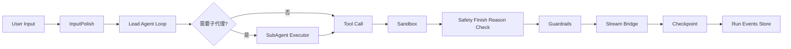
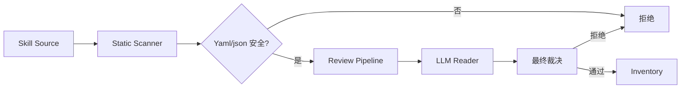

# QiLin 引擎整体技术架构

> [!WARNING]
> 历史参考，非现行架构。本文与 `modules/`、`diagrams/` 描述的是 QiLin 早期基于 LangGraph 的 Python 引擎（`qilin/` + `app/`，已退役）。现行引擎是本仓库的 TypeScript 插件树（`@qilin/*`，架构见 [architecture.md](../architecture.md)）；本文仅作设计谱系与决策追溯使用。

> QiLin Engine — Overall Technical Architecture
>
> 版本 / Version: 2.0.0 · 更新 / Updated: 2026-08

---

## 中文版

### 1. 概述

**QiLin** 是一个面向生产场景的智能体（Agent）引擎框架，提供从模型调用、工具执行、记忆管理、权限授权、技能扩展到端到端运行调度的完整能力栈。其设计目标是：在不牺牲可扩展性的前提下，把 LangGraph 的图执行能力与长生命周期任务（队列、定时、后台运行）封装为可独立部署、嵌入式运行、也可服务化托管的引擎。

核心设计哲学：

| 设计原则 | 落地手段 |
|---------|---------|
| **嵌入式优先** | `QiLinClient` 暴露纯 Python API，无需启动 LangGraph Server / Gateway 进程 |
| **服务化可托管** | 同一份代码可被 Gateway / Service 进程加载，对外暴露 HTTP/SSE |
| **配置驱动 / 热重载** | `config.yaml` + 环境变量双重配置，文件签名变更即热重载 |
| **子代理是一等公民** | SubAgent 执行器与 Lead Agent 同构，可无限嵌套、并行、审批门控 |
| **沙箱隔离** | `sandbox` 抽象层为工具调用提供本地/Docker/E2B/BoxLite 多后端隔离 |
| **可观测性自带** | `tracing` 内置 Langfuse/Monocle 适配；`run events` 持久化到 DB/SQLite/JSONL |

### 2. 分层架构

QiLin 采用经典的"内核 + 外延 + 服务面"三层架构：

```
┌────────────────────────────────────────────────────────────┐
│  Service Surface (服务面)                                  │
│    └─ TUI · Gateway · Channels · Scheduler API ·           │
│       LangGraph Server · Embedded Client                   │
├────────────────────────────────────────────────────────────┤
│  Engine Core (内核)                                         │
│    ├─ agents · subagents · orchestration · tools · skills  │
│    ├─ mcp · runtime · persistence · scheduler              │
│    ├─ config · sandbox · memory · guardrails · authz       │
├────────────────────────────────────────────────────────────┤
│  Foundation (基础层)                                       │
│    ├─ models · tracing · reflection · utils · uploads      │
│    └─ LangChain / LangGraph · Pydantic · SQLAlchemy · ACP  │
└────────────────────────────────────────────────────────────┘
```

#### 2.1 基础层（Foundation）

- **models**：统一的聊天模型工厂层，封装 OpenAI / Anthropic / DeepSeek / Google GenAI / Ollama / 自定义 Provider
- **tracing**：Langfuse + Monocle 双适配的可观测性中枢，提供请求级 trace_id 贯穿
- **reflection**：从配置中解析 `${VAR}` 形式的变量引用，并发安全且支持默认值
- **utils**：与业务无关的纯函数工具（日志、JSON、文件 I/O、限流、Hash 等）
- **uploads**：用户上传文件的统一管理、虚拟路径映射、生命周期跟踪

#### 2.2 引擎内核（Engine Core）

内核层是 QiLin 的核心，由 15 个相互协作的子系统组成：

| 模块 | 职责 |
|------|------|
| **agents** | Lead Agent 工厂、LangGraph 中间件链、线程状态模式、记忆后端抽象、目标状态 |
| **subagents** | 子代理执行器、注册中心、配置解析、内置（general-purpose / bash_agent）、并行批次执行 |
| **orchestration** | v2.0.0 多智能体编排：handoff 协议、OrchestratorGraph 编排图、AgentInbox 消息总线、协作模式 |
| **tools** | 工具清单注册与装配（含 MCP 工具、内建工具、子代理任务工具、ACP 代理工具） |
| **skills** | 技能清单、Markdown 描述、解析器、安装器、安全扫描器、目录权限控制 |
| **mcp** | MCP（Model Context Protocol）服务器适配：客户端、连接池、缓存、工具元数据 |
| **runtime** | LangGraph 运行器、checkpoint、Store、事件流、SSE 流桥、定时器、用户上下文 |
| **persistence** | 多后端持久化层：agents · run · thread · feedback · scheduled_task · channel · webhook |
| **scheduler** | 一次性 + Cron 定时任务的轮询与派发 |
| **config** | Pydantic 化的配置加载、env 解析、运行时热重载、签名检测 |
| **sandbox** | 抽象沙箱接口 + 本地 / AIO / Docker / E2B / BoxLite / Tenki 多实现 |
| **memory** | 事实抽取、合并、防抖去重、注入格式化、检索索引（FTS5 / Mem0 / Noop） |
| **guardrails** | 中间件式安全护栏（内置 provider + 自定义），用于拦截不安全输入/输出 |
| **authz** | RBAC 风格的资源授权过滤器、principal 适配器、运行时强制 |
| **integrations** | 第三方渠道集成（飞书 Lark / Lark CLI 等） |

#### 2.3 服务面（Service Surface）

服务面负责把内核的能力暴露给外部消费者：

- **TUI** (`qilin.tui`)：基于 Textual 的终端工作台，支持交互式会话、流式渲染、命令面板、剪贴板视图
- **Embedded Client** (`QiLinClient`)：纯 Python 编程接口，可在同进程内启用 `client.chat()` / `client.stream()`
- **Gateway** (`app/gateway`)：FastAPI HTTP Agent Server，提供 agents / threads / runs / memory / skills / mcp / uploads / artifacts / channels / scheduled_tasks 等 20+ 组 REST 路由，内置 JWT 认证、CSRF / CORS 防护、trace 中间件与 GitHub Webhook 接入
- **Channels** (`app/channels`)：IM 渠道接入层，统一管理飞书 / Discord / Slack / Telegram / 钉钉 / 企微 / 微信 / GitHub 8 大渠道的连接、消息收发、去重与运行策略
- **Scheduler API** (`app/scheduler`)：定时任务的 HTTP 管理服务，复用 `qilin.scheduler` 调度内核
- **LangGraph Server 兼容**：内核本身遵循 LangGraph API 协议，可被 `langgraph dev` / `langgraph up` 直接加载

> 注：`app/` 服务面随 `qilin` wheel 一并分发，需通过 `qilin[gateway]` / `qilin[channels]` extras 安装依赖后启用。

### 3. 关键运行机制

#### 3.1 请求生命周期



每一跳都有对应的中间件（middleware）兜底：循环检测、读取前置写入、工具进度状态机、Token 预算熔断。

#### 3.2 工具调用流水线

工具从"声明"到"调用"经过四层抽象：

1. **声明层**（`config/tool_config.py`）：通过 `ToolConfig` / `ToolGroupConfig` 在 YAML 中声明
2. **装配层**（`tools/tools.py`）：根据声明将工具绑定到 Runtime，会引入 MCP 工具 / 子代理工具
3. **同步包装层**（`tools/sync.py`）：为同步流式客户端提供 async→sync 的桥接
4. **元数据层**（`tools/mcp_metadata.py`）：为 MCP 工具贴 `mcp_sourced` 标签，便于路由与审计

#### 3.3 子代理递归执行

子代理是 QiLin 区分于普通图执行器的关键能力：

- 拥有独立 LangGraph 实例、独立 checkpoint 通道、独立 callbacks
- 可以再嵌套子代理，深度可配置（默认递归 ≤ 配置上限）
- 通过 `task_tool` 与 `invoke_acp_agent_tool` 触发
- 通过 `status_contract.py` 与 `step_events.py` 统一上报协议

#### 3.4 沙箱抽象

`SandboxProvider` 接口提供：

```python
async with sandbox.open() as sb:
    result = await sb.run(cmd, **kwargs)
```

实现包括：

- `LocalSandbox`：本机 fork+namespace 隔离（开发用）
- `aio_sandbox`：本地 Docker 异步沙箱（生产首选）
- `boxlite`：BoxLite 内核级沙箱（强隔离）
- `e2b_sandbox`：云端 E2B SDK
- `tenki`：Tenki 商业云沙箱

#### 3.5 持久化分层

| 对象 | 默认存储 | 可选存储 |
|------|---------|---------|
| Agent 定义 | 文件 + DB | – |
| Run / Thread 状态 | SQLite (WAL) / PostgreSQL | – |
| Run Events | SQLite（嵌入式 / `events-store=db`） | JSONL / Memory |
| Token 用量 | DB | – |
| 技能存储 | File + Scanner | – |
| Skills 状态 | DB | – |
| Webhook 去重 | Memory / PostgreSQL | Auto |
| 渠道连接 | DB | – |

#### 3.6 多智能体编排（v2.0.0）

v2.0.0 在单智能体基座上新增编排层，运行形态由 `orchestration.mode` 选择：

- **single**（默认）：v1.0.0 lead agent + `task_tool` 委派行为完全不变
- **multi**：`make_lead_agent` 构建 OrchestratorGraph（1 个 orchestrator 节点 + N 个 worker 节点），按 `to_agent` 路由，`max_rounds` 防死循环

编排栈（自底向上）：

1. **subagents/batch**（P0）：`run_batch_async` 有界并发执行独立子代理任务，失败隔离 + 保序返回
2. **orchestration/handoff**（P1）：`AgentHandoff` 结构化上下文转移协议，`inherit_trace_id` 跨 agent 贯穿 trace
3. **orchestration/graph**（P1）：OrchestratorGraph 编排图构建器
4. **orchestration/inbox**（P2）：`AgentInbox` 每 agent 一个 `asyncio.Queue` 的消息总线 + 订阅广播
5. **orchestration/patterns**（P2）：orchestrator-workers（同任务并行分派 + 聚合）与 peer-consensus（对等共识）协作模式

治理与可观测：`authz.principal.normalize_agent_identity` 提供 agent 维度身份；`TokenBudgetConfig.per_agent` 提供 per-agent 配额；模式切换属图结构变更，注册为 startup-only（需重启）。

### 4. 配置系统

#### 4.1 配置加载优先级

```
1) 命令行 config_path 参数
2) QILIN_CONFIG_PATH 环境变量
3) 工程根目录 config.yaml
4) 源码树内 backend/config.yaml（向后兼容）
```

#### 4.2 热重载

- **签名检测**：`ConfigSignature` 对文件做内容签名哈希，内容变化即重载
- **重载分层**：模型 / 工具 / 沙箱 provider 等子配置有独立的 `load_X_config_from_dict` 函数，变更不会重新初始化 DB 连接池
- **重载禁区**：`sandbox` / `database` / `checkpointer` 等结构性配置需重启进程

#### 4.3 环境变量约定

所有环境变量名以 `QILIN_` 为前缀，例如：

```
QILIN_CONFIG_PATH
QILIN_HOME
QILIN_HOST_BASE_DIR
QILIN_SANDBOX_HOST
QILIN_SANDBOX_BIND_HOST
QILIN_ENV                       # 部署环境标签 (dev/staging/prod)
QILIN_TUI                       # 启用 TUI 替代 headless
QILIN_FILE_IO_WORKERS           # 文件 I/O 工作线程数
```

### 5. 可观测性

#### 5.1 Trace 上下文

每个请求头携带 `X-Trace-Id`，经 `TraceMiddleware` 校验后存入 `ContextVar`，在日志、RunEvent、Langfuse metadata 中保持一致。

#### 5.2 多后端追踪

```
tracing/
├── metadata.py        # 把 trace_id 注入 Langfuse / Monocle
├── monocle.py         # OpenTelemetry 风格追踪
└── factory.py         # 多 provider 路由
```

#### 5.3 Run Events

所有运行事件通过统一的 `run-event` envelope 持久化，支持：

- `type`：32 字符以内的语义化类型
- `category`：16 字符以内的分类
- `payload`：结构化 JSON

### 6. 安全模型

#### 6.1 攻击面

- **输入面**：`InputPolish` 中间件清理用户输入
- **输出面**：`SafetyFinishReason` 拦截 provider 返回的安全过滤信号
- **工具执行面**：子代理通过 `is_host_bash_allowed` 控制主机 Bash 调用；其他工具跑在沙箱里
- **权限面**：`authz.principal` + `authz.rbac` 提供基于属性的资源授权

#### 6.2 技能安全



每个技能都经 `skillscan.orchestrator` 走静态分析 + LLM 双审，签名通过后入 `inventory`。

### 7. 扩展点

| 扩展点 | 入口 |
|--------|------|
| 新 Provider | `models/` 子类化 `BaseChatModel` |
| 新 Sandbox | `sandbox/SandboxProvider` |
| 新 Memory Backend | `agents/memory/backends/`（基于 `MemoryManager` ABC） |
| 新 Tool | `tools/builtins/` 或通过 MCP 自动注入 |
| 新协作模式 | `orchestration/patterns`（复用 `run_batch_async` / `AgentInbox`） |
| 新 Subagent | `subagents/builtins/` + `subagents/registry.register` |
| 新 Guardrail | `guardrails/GuardrailProvider` |
| 新 Authorization 策略 | `authz/enforcement` |
| 新 Tracing Provider | `tracing/factory.register` |

### 8. 数据流示例

**场景：用户上传 PDF + 提问"摘要 PDF 关键观点"**

1. 上传文件 → `uploads` 模块虚拟路径映射
2. 用户消息进入 → Lead Agent 在 `agents/lead_agent/prompt.py` 加载系统 prompt
3. LLM 决定调用 `read_doc` 工具 → `tools/builtins/present_file_tool.py`
4. 工具通过 `sandbox`（默认 aio_sandbox）执行 `markitdown` 转 Markdown
5. LLM 拿到提取结果生成回答
6. 全程通过 `tracing` 上报 Langfuse；run event 落入 `persistence/run/`

---

## English Version

### 1. Overview

**QiLin** is a production-grade agent-engine framework that consolidates model orchestration, tool execution, memory management, fine-grained authorization, skill extensions, and end-to-end run scheduling into a single deployable unit. The engine is designed for three runtime modes: embedded (same-process Python), hosted (LangGraph Server / Gateway), or hybrid (both concurrently), without code duplication.

| Principle | Implementation |
|-----------|----------------|
| **Embedded-first** | `QiLinClient` exposes a pure-Python API; no LangGraph Server / Gateway required |
| **Service-ready** | The same code can be loaded by a Gateway / service and exposed via HTTP/SSE |
| **Config-driven hot reload** | `config.yaml` plus env vars; signature change triggers reload |
| **Sub-agents are first-class** | SubAgent executor is isomorphic with Lead Agent — infinite nesting, parallel, gateable |
| **Hardened sandbox isolation** | Pluggable sandbox: local / Docker / E2B / BoxLite / Tenki |
| **Observability by default** | `tracing` adapts Langfuse / Monocle; `run events` persist to DB / SQLite / JSONL |

### 2. Layered Architecture

```
┌────────────────────────────────────────────────────────────┐
│  Service Surface                                          │
│    └─ TUI · Gateway · Channels · Scheduler API ·          │
│       LangGraph Server · Embedded Client                  │
├────────────────────────────────────────────────────────────┤
│  Engine Core                                               │
│    ├─ agents · subagents · orchestration · tools · skills │
│    ├─ mcp · runtime · persistence · scheduler             │
│    ├─ config · sandbox · memory · guardrails · authz      │
├────────────────────────────────────────────────────────────┤
│  Foundation                                                │
│    ├─ models · tracing · reflection · utils · uploads      │
│    └─ LangChain / LangGraph · Pydantic · SQLAlchemy · ACP  │
└────────────────────────────────────────────────────────────┘
```

#### 2.1 Foundation

- **models** — Unifying chat-model factory; OpenAI / Anthropic / DeepSeek / Google GenAI / Ollama / custom providers
- **tracing** — Langfuse + Monocle dual-trace adapters with request-level `trace_id`
- **reflection** — `${VAR}` resolution from config with concurrency safety
- **utils** — Business-agnostic helpers (logging, JSON, file I/O, rate-limit, hashing)
- **uploads** — Unified upload manager; virtual-path mapping and lifecycle tracking

#### 2.2 Engine Core

| Module | Responsibility |
|--------|----------------|
| **agents** | Lead-Agent factory, LangGraph middleware chain, thread-state schema, memory backend abstraction, goal state |
| **subagents** | Sub-agent executor, registry, config resolver, built-ins (general-purpose / bash_agent), parallel batch execution |
| **orchestration** | v2.0.0 multi-agent orchestration: handoff protocol, OrchestratorGraph, AgentInbox message bus, collaboration patterns |
| **tools** | Tool registry & assembly: built-ins, MCP tools, sub-agent task tool, ACP agent tool |
| **skills** | Skill catalog, Markdown descriptor, parser, installer, security scanner, path-based permissions |
| **mcp** | Model Context Protocol client, connection pool, cache, tool metadata |
| **runtime** | LangGraph runner, checkpoint, Store, event stream, SSE stream bridge, journal, user context |
| **persistence** | Pluggable storage: agents · run · thread · feedback · scheduled_task · channel · webhook |
| **scheduler** | One-shot + cron polling & dispatch |
| **config** | Pydantic-driven config loading, env resolution, hot reload, signature detection |
| **sandbox** | Sandbox abstraction with local / AIO / Docker / E2B / BoxLite / Tenki implementations |
| **memory** | Fact extraction, merge, debounce, injection format, retrieval index (FTS5 / Mem0 / Noop) |
| **guardrails** | Middleware-style safety guardrails (built-in + custom) |
| **authz** | RBAC-style resource authorization filter, principal adapter, runtime enforcement |
| **integrations** | 3rd-party channel integrations (Lark / Lark CLI, etc.) |

#### 2.3 Service Surface

- **TUI** (`qilin.tui`) — Textual-based terminal workbench: interactive sessions, streaming, command palette, clipboard view
- **Embedded Client** (`QiLinClient`) — Pure-Python API; `client.chat()` / `client.stream()` in process
- **Gateway** (`app/gateway`) — FastAPI HTTP Agent Server: 20+ REST route groups (agents / threads / runs / memory / skills / mcp / uploads / artifacts / channels / scheduled_tasks), with JWT auth, CSRF / CORS protection, trace middleware, and GitHub webhook ingestion
- **Channels** (`app/channels`) — IM channel adapter layer: Feishu / Discord / Slack / Telegram / DingTalk / WeCom / WeChat / GitHub, covering connection, messaging, dedupe, and run policies
- **Scheduler API** (`app/scheduler`) — HTTP management service for scheduled tasks, reusing the `qilin.scheduler` kernel
- **LangGraph Server compatible** — Kernel follows LangGraph API contract; loadable via `langgraph dev`

> Note: the `app/` service surface ships in the wheel; install `qilin[gateway]` / `qilin[channels]` to enable it.

### 3. Runtime Mechanisms

#### 3.1 Request Lifecycle

```
User Input → InputPolish → Lead Agent Loop → (Sub-Agent?) → Tool Call
   → Sandbox → Safety Finish Reason → Guardrails → Stream Bridge
   → Checkpoint → Run Events Store
```

Each hop is guarded by a middleware: loop detection, read-before-write gate, tool progress state machine, token budget circuit breaker.

#### 3.2 Tool-Call Pipeline

From declaration to invocation, tools pass through four layers:

1. **Declaration layer** (`config/tool_config.py`) — `ToolConfig` / `ToolGroupConfig` declared in YAML
2. **Assembly layer** (`tools/tools.py`) — Binds tool to Runtime, pulls MCP / sub-agent tools
3. **Sync wrapper** (`tools/sync.py`) — Provides async→sync bridge for synchronous streaming clients
4. **Metadata layer** (`tools/mcp_metadata.py`) — Tags MCP tools with `mcp_sourced` for routing / audit

#### 3.3 Sub-Agent Recursion

Sub-agents are the defining capability of QiLin versus plain graph runners:

- Each sub-agent has its own LangGraph instance, checkpoint channel, callbacks
- Arbitrary nesting (with configured depth cap)
- Triggered via `task_tool` / `invoke_acp_agent_tool`
- Standardized reporting via `status_contract.py` and `step_events.py`

#### 3.4 Sandbox Abstraction

```python
async with sandbox.open() as sb:
    result = await sb.run(cmd, **kwargs)
```

Implementations:

- `LocalSandbox` — local fork + namespace (dev)
- `aio_sandbox` — local Docker async sandbox (production)
- `boxlite` — BoxLite kernel-level sandbox
- `e2b_sandbox` — E2B cloud SDK
- `tenki` — Tenki commercial sandbox

#### 3.5 Persistence Layers

| Object | Default | Optional |
|--------|---------|----------|
| Agent definitions | File + DB | — |
| Run / Thread state | SQLite (WAL) / PostgreSQL | — |
| Run Events | SQLite (embedded / `events-store=db`) | JSONL / Memory |
| Token usage | DB | — |
| Skill storage | File + Scanner | — |
| Skills state | DB | — |
| Webhook dedupe | Memory / PostgreSQL | Auto |
| Channel connections | DB | — |

#### 3.6 Multi-Agent Orchestration (v2.0.0)

v2.0.0 adds an orchestration layer on top of the single-agent base. The runtime shape is chosen by `orchestration.mode`:

- **single** (default) — v1.0.0 lead agent + `task_tool` delegation, unchanged
- **multi** — `make_lead_agent` builds an OrchestratorGraph (1 orchestrator node + N worker nodes), routed by `to_agent`, with `max_rounds` guarding against loops

The stack (bottom-up):

1. **subagents/batch** (P0) — `run_batch_async` executes independent subagent tasks with bounded concurrency, failure isolation, and order-preserving results
2. **orchestration/handoff** (P1) — `AgentHandoff` structured context transfer; `inherit_trace_id` keeps one trace across agents
3. **orchestration/graph** (P1) — OrchestratorGraph builder
4. **orchestration/inbox** (P2) — `AgentInbox` message bus (one `asyncio.Queue` per agent) with subscription broadcast
5. **orchestration/patterns** (P2) — orchestrator-workers (parallel dispatch + aggregation) and peer-consensus collaboration patterns

Governance & observability: `authz.principal.normalize_agent_identity` adds an agent dimension to authorization; `TokenBudgetConfig.per_agent` provides per-agent quotas; mode switching rebuilds the graph and is registered as startup-only (restart required).

### 4. Configuration System

#### 4.1 Load Order

```
1) CLI config_path argument
2) QILIN_CONFIG_PATH environment variable
3) Project root config.yaml
4) Source-tree backend/config.yaml (backward compat)
```

#### 4.2 Hot Reload

- **Signature detection** — `ConfigSignature` computes a content signature; reload on change
- **Layered reload** — Each sub-config has its own `load_X_config_from_dict`; partial changes don't rebuild DB pools
- **Reload forbidden zones** — `sandbox` / `database` / `checkpointer` need process restart

#### 4.3 Env Var Convention

All env vars are prefixed with `QILIN_`:

```
QILIN_CONFIG_PATH
QILIN_HOME
QILIN_HOST_BASE_DIR
QILIN_SANDBOX_HOST
QILIN_SANDBOX_BIND_HOST
QILIN_ENV                       # deployment label (dev/staging/prod)
QILIN_TUI                       # enable TUI over headless
QILIN_FILE_IO_WORKERS           # file I/O worker count
```

### 5. Observability

#### 5.1 Trace Context

Request header `X-Trace-Id` is validated by `TraceMiddleware` and stored in a `ContextVar`. The same id appears in logs, RunEvents and Langfuse metadata.

#### 5.2 Multi-Backend Tracing

```
tracing/
├── metadata.py        # inject trace_id into Langfuse / Monocle
├── monocle.py         # OTel-style tracing
└── factory.py         # multi-provider router
```

#### 5.3 Run Events

All events flow through a unified envelope:

- `type` — semantic type (≤ 32 chars)
- `category` — short category (≤ 16 chars)
- `payload` — structured JSON

### 6. Security Model

#### 6.1 Attack Surface

- **Input surface** — `InputPolish` middleware cleans user input
- **Output surface** — `SafetyFinishReason` intercepts provider safety-filter signals
- **Tool execution** — Sub-agents gate `host bash` via `is_host_bash_allowed`; other tools run in sandbox
- **Authorization** — `authz.principal` + `authz.rbac` provide attribute-based resource authorization

#### 6.2 Skill Security

```
Skill Source → Static Scanner → (yaml/json safe?) → Review Pipeline
   → LLM Reader → Final Ruling → (pass → Inventory / reject)
```

Each skill passes through `skillscan.orchestrator` doing both static analysis and LLM review; signed skills join the inventory.

### 7. Extension Points

| Extension | Entry |
|-----------|-------|
| New provider | subclass `BaseChatModel` under `models/` |
| New sandbox | implement `sandbox.SandboxProvider` |
| New memory backend | subclass `MemoryManager` ABC under `agents/memory/backends/` |
| New tool | drop into `tools/builtins/` or expose via MCP |
| New collaboration pattern | `orchestration/patterns` (reusing `run_batch_async` / `AgentInbox`) |
| New sub-agent | add to `subagents/builtins/` + `subagents/registry.register` |
| New guardrail | implement `guardrails.GuardrailProvider` |
| New authz policy | extend `authz/enforcement` |
| New tracing provider | `tracing/factory.register` |

### 8. End-to-End Data Flow Example

**Scenario:** user uploads a PDF and asks "Summarize the key points."

1. Upload → `uploads` module maps a virtual path
2. User message → Lead Agent loads system prompt from `agents/lead_agent/prompt.py`
3. LLM decides to call `read_doc` (in `tools/builtins/present_file_tool.py`)
4. Tool invokes `markitdown` via `sandbox` (default: `aio_sandbox`)
5. LLM receives extracted Markdown and produces the answer
6. The whole flow is reported to Langfuse via `tracing`; run events fall into `persistence/run/`

---

> 维护者 / Maintainer: QiLin Team · 反馈 / Feedback: 请提交 Issue
